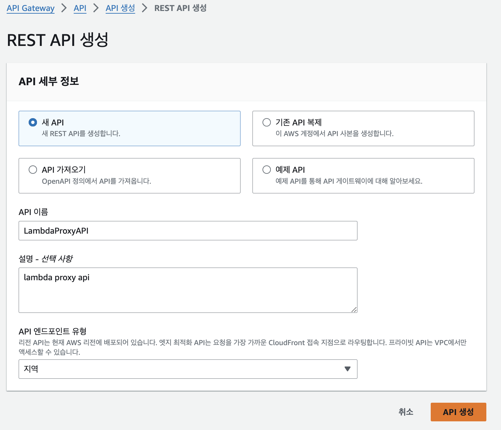
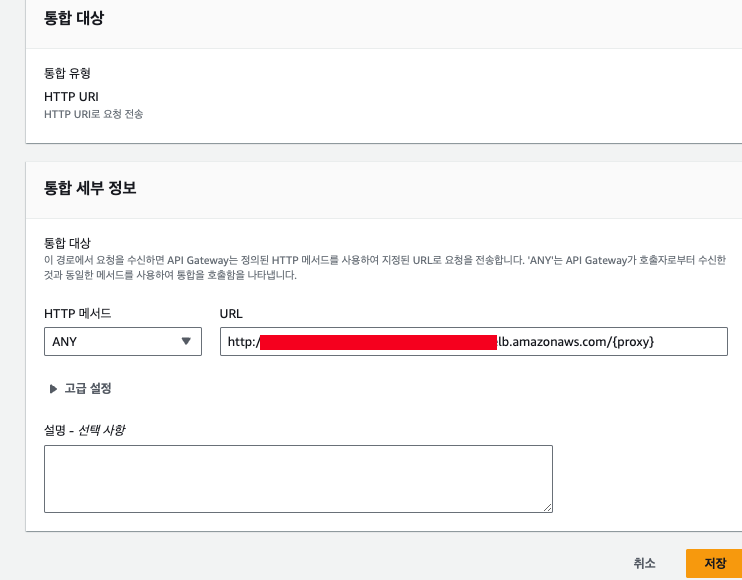
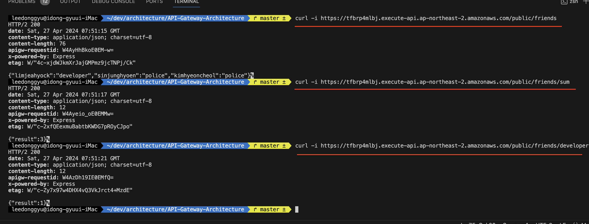
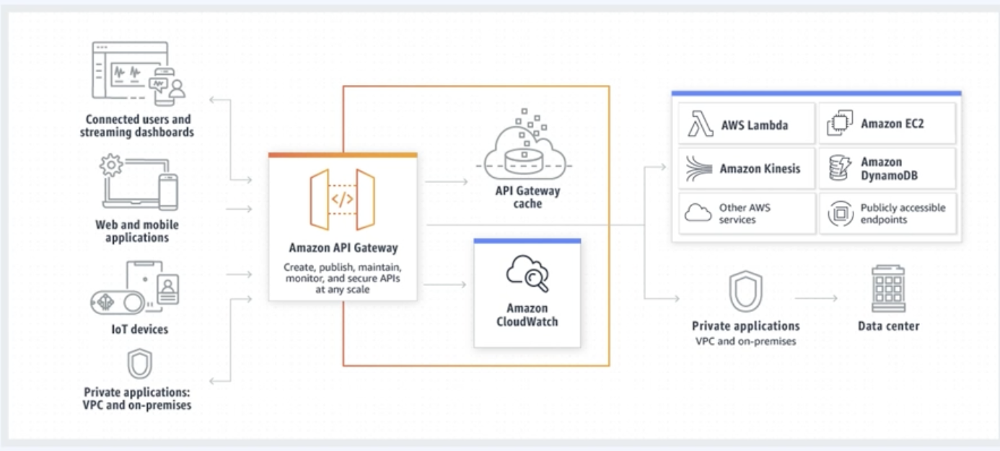
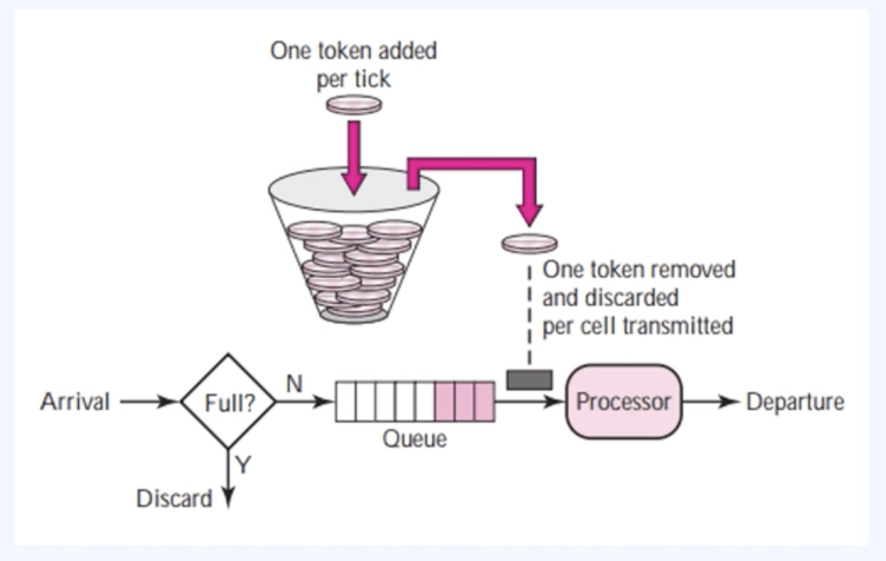

## Architecture


```
    terraform init
    terraform apply --auto-approve
```

## 구조

- Service-A

    - <b>api-gateway -> VPC link -> Private Subnet(ALB -> ECS)</b>

- Service-B

    - <b>api-gatweay -> Public Subnet(ALB -> ECS)</b>

## api-gateway proxy 설정하는 법

### api-gateway Route 설정

- public/{proxy+}
- private/{proxy+}



### ALB 구성에서 Path에 {proxy} 추가

- Serivce_A_ALB_DNS/{proxy}
- Service_B_ALB_DNS/{proxy}



### 결과



## RateLimit 알고리즘



- Stateful (WebSocket), Stateless (HTTP, REST) API지원
- REST 기반의 관리기능이 필요하지 않다면, HTTP API를 사용하는 것이 좋음
- HTTP API의 경우 REST API보다 71% 비용절감 60% 지연절감이 있음
- Canary 릴리즈 배포가능 (ECS도 가능한가?)
- CloudWatch 및 액세스 로깅 가능
- WAF, X-ray와 같은 서비스와 같이 사용할 수 있음

## API Gatewy는 어떻게 가용성을 유지할까? (Rate Limit)

- 과도한 트래픽으로부터 서비스를 보호 + Resource 사용의 대한 서비스 예산을 넘기지 않게 예방
- <b>아래의 Rate Limit 알고리즘을 활용하여, 회사내의 Traffic Pattern을 파악 후 적절한 알고리즘을 선택해야 함</b>
- 사용량이 많아진다면, Rate Limit을 적용하는 것이 좋음 (이건 충분히 공부해봐야 할듯...)

### Leaky Bucket 알고리즘

- Bucket은 일정하게 10개씩 출력을 한다는 가정임, 입력이 10, 100, 1000개가 들어오든 출력은 일정
- 네트워크 데이터 주입속도의 대한 상한을 정할 수 있음
- 네트워크의 대한 트래픽 Burst를 일정하게 유지한다
- 만약 유입의 속도가 너 많다면? (입력 속도 > 출력 속도) -> 넘치는 입력을 버림 (overflow) -> <b>패킷 손실</b>
- Nginx가 이와 같음

### Token Bucekt 알고리즘 (*)



- 평균 유입속도를 제한하고, <b>처리패킷 손실없이 특정</b>
- 특정 수준의 Burst 요청을 처리함
- API Gateway, EC2, ...

### Fixed Window Counter 알고리즘

- 정해진 시간대의 Window가 만들어지고, 요청건수가 기록되어 요청건수 > 정해진 건수 -> 요청은 처리가 거부됨

## Reference

- apigateway는 테라폼으로 구성할 엄두가 안남
- <a href="https://hub.docker.com/repository/docker/zkfmapf123/donggyu-friends/general"> zkfmapf123/donggyu-friends public registry </a>